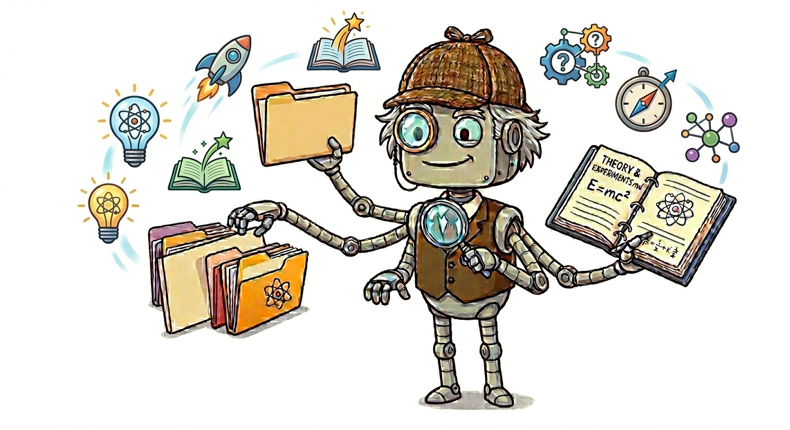

# Claude Researcher Skill

<p align="center"></p>

This skill provides a research structured workflow , collect multiple solution options from the web, organize findings into folders, optionally test each option, and produce a scored final decision.

## What This Skill Does

- Creates a dedicated `<problem_name>_problem/` workspace.
- Searches for candidate solutions from multiple source types (community, articles, code repos, academic, reference docs, videos).
- Organizes each solution into its own directory with documentation notes.
- Produces a per-solution `README.md` with summary, sources, pros, and cons.
- Optionally tests each solution and records reproducible outcomes.
- Generates a final `decision/DECISION.md` with weighted scoring and a recommended choice.

## Install

Use one of the setups below depending on how you use skills.

#Install

1. Create a global skills directory if needed (example):
   - `~/.claude/skills/researcher/`
2. Copy this skill file into that folder as:
   - `~/.claude/skills/researcher/SKILL.md`
3. Restart your agent/CLI session so the skill is reloaded.

## How To Use

Ask for research tasks with prompts like:

- "Research solutions for fixing slow API response times."
- "Compare approaches for background jobs in Node.js."
- "Investigate options for vector databases for RAG."

The skill follows this flow:

1. Create problem directory.
2. Search for candidate solutions in parallel.
3. Create one directory per solution.
4. Gather source documentation into markdown files.
5. Write per-solution summary (`README.md`).
6. Optionally test each solution and write `test_results_<solution>.md`.
7. Create `decision/DECISION.md` with weighted scores and final recommendation.

## Workflow

```
┌─────────────────────────────────────────────────────────────────┐
│                     RESEARCHER SKILL WORKFLOW                   │
└─────────────────────────────────────────────────────────────────┘

  Step 1 ─ Create Problem Directory
           mkdir <problem_name>_problem/
           → Confirm with user ✓

  Step 2 ─ Search for Solutions in Parallel
           Subagents (Sonnet) search across:
           Community · Articles · Code · Academic · Reference · Video
           Present list of solutions found.
           → Confirm with user (may exclude solutions) ✓

  Step 3 ─ Create One Directory per Solution
           solution_<name>/
             README.md
             documentation/

  Step 4 ─ Gather Documentation per Solution
           Parallel subagents (Sonnet) — one per source category
           Each produces documentation/<doc_topic>.md

  Step 5 ─ Document Each Solution
           Write solution README.md with:
           Summary · Sources · Pros · Cons
           → Ask: "Test each solution or compare docs only?" ✓
                        │
             ┌──────────┴──────────┐
             │ Test                │ Skip
             ▼                     ▼
  Step 6 ─ Test Each Solution      │
           Sequential subagents    │
           (Sonnet, one at a time) │
           Write test_results_     │
           <solution>.md           │
             └──────────┬──────────┘
                        ▼
  Step 7 ─ Decision Summary  (Opus)
           decision/DECISION.md with:
           Scoring table · Weighted aspects · Final recommendation
           → Present and confirm with user ✓
```

| Step | Action | Model | Confirm? |
|------|--------|-------|----------|
| 1 | `mkdir <problem>_problem/` | — | Yes |
| 2 | Parallel subagents — search (docs, GitHub, Reddit, SO, etc.) | Sonnet | Yes |
| 3 | `mkdir solution_<name>/` + `documentation/` per solution | — | — |
| 4 | Parallel subagents — gather docs into `documentation/<topic>.md` | Sonnet | — |
| 5 | Write `README.md` with summary, sources, pros/cons | — | Yes |
| 6 | Sequential subagents — test each solution, write `test_results_<name>.md` | Sonnet | — |
| 7 | Create `decision/DECISION.md` with scoring table and final decision | Opus | Yes |

## Output Structure

```text
<problem_name>_problem/
  solution_<name_a>/
    README.md
    documentation/
      <doc_topic>.md
    test_results_<name_a>.md
  solution_<name_b>/
    README.md
    documentation/
      <doc_topic>.md
    test_results_<name_b>.md
  decision/
    DECISION.md
```

## License

This project is licensed under the [GNU General Public License v3.0](LICENSE).

